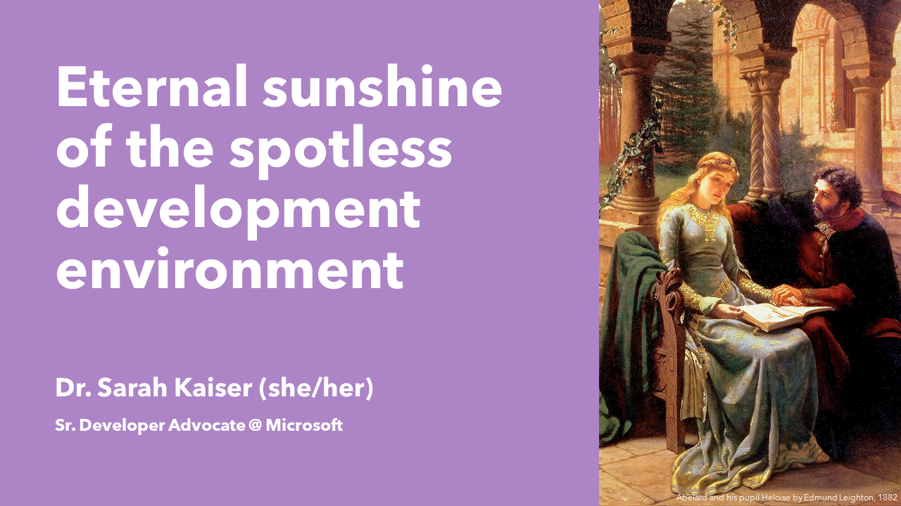

# 
[Schedule](https://2023.pycascades.com/program/talks/eternal-sunshine-of-the-spotless-development-environment/) | [Slides](slides.pdf) | [Demo](demo.ipynb) | [Title inspo: Eloisa To Abelard by Alexander Pope](https://gutenberg.org/cache/epub/9413/pg9413-images.html#link2H_4_0051:~:text=Eternal%20sunshine%20of%20the%20spotless%20mind!)

"But it worked on machine" is one the most frustrating lines to hear when collaborating on a project. Creating and configuring reproducible environments is a major part of modern software development and had led to the popularity of tools like Docker to specify where and how code runs. Setting up Docker and Development Containers in VS Code make it easy to configure not only the where the code runs, but also the developer workspace. Setting up these tools can reduce effort for maintainers of OSS projects, bootstrap contributors, and make running events like workshops or sprints go more smoothly.
In this talk, we will cover why setting up container infrastructure like Docker can be useful for your project, and how you can extend that with Dev Containers to configure a full development experience in VS Code. We will also take a look at two common OSS project scenarios and how workflows for using Docker, Dev Containers and Codespaces make things easier. No container experience required, and some knowledge of VS Code helpful, but not necessary.

## Topics

- Dev Containers: "Desires composed, affections ever even"
  - Docker setup is portable, but not necessarily editor specific
  - Specifying an entire VS Code dev experience: JSON with optional Docker file
  - Quick look at the .decontainer file spec
  - Sample repo and demo starting experience when cloning a new repo
- Contribution + Collaboration: "Each PR accepted, and each issue closed"
  - Can help simplify/exemplify CONTRIBUTING.md
  - Easily share how you develop with contributors or create a container that demos a problem to share
  - Future: Dev Containers can be shared with CI like GitHub actions so it is using the exact same env as well
- Workshops: "Unequal task! a passion to resign"
  - Dev containers create accessible and free, out-of-the-box experiences for teaching spaces
  - Users can launch and use entirely from the browser
  - Different levels of hardware backend compute available

### Speaker Profile:

Sarah has spent most of her career developing technology in the lab, from virtual reality hardware to satellites. She got her PhD in Physics by starting plasma fires with lasers, Python, and Jupyter Notebooks. She has also written tech books for folks of all ages, including ABCs of Engineering and Learn Quantum Computing with Python and Q#.  As a Cloud Developer Advocate for Python at Microsoft and a Python Software Foundation Fellow, she finds all kinds of new ways to build and break OSS tools for data science and machine learning. When not at her split ergo keyboard, she loves boating in the Seattle area, laser cutting everything, and playing with her German Shepard, Chewie.

[sckaiser.com](https://sckaiser.com) | [Mastodon](https://mathstodon.xyz/@crazy4pi314) | [GitHub](https://github.com/crazy4pi314)

### Bonus

This talk repo is based on a [template reposotory](https://github.com/crazy4pi314/conda-devcontainer-demo?WT.mc_id=python-91783-sarahakaiser) that can be used to start with a minimal [Dev Container](https://containers.dev/) setup that provides [conda](https://github.com/conda/conda) and [mamba](https://github.com/mamba-org/mamba) for setting up Python environments.
You can find a blog post on how to use it on [Dev.to](https://dev.to/crazy4pi314/how-to-get-the-best-conda-environment-experience-in-codespaces-4na9?WT.mc_id=python-91783-sarahakaiser).
